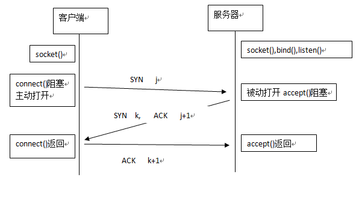

# socket通讯原理
## 网络间进程如何进行通讯
本地的进程间通讯我们知道有很多种实现方式，可以总结为这四类：消息传递（管道，FIFO，消息队列），同步（互斥量、条件变量、读写锁、文件和写记录锁、信号量），共享内存，远程过程调用。  
那么网络间进程通讯如何实现呢？  
解决这个问题，我们首先要思考如何唯一标识网络间的进程。在本地进程间，可以通过PID来唯一标识，但在网络间这明显是行不通。其实tcp/ip协议簇已经帮我们解决了这个问题，通过网络层的ip协议帮助我们确定网络间的唯一主机，而传输层的“协议+端口”可以确定主机中唯一的应用程序（进程）。这样利用（ip，协议，端口）三元数组就能唯一标识网络间的进程了。
使用tcp/ip协议簇的应用程序通常都采用应用编程接口（socket和TLI）来进行通讯。而TLI这种似乎已经被淘汰了，现在基本都是使用的socket实现通讯。
## 什么是socket？
socket一词源于UNIX，而UNIX的哲学理论就是“一切皆是文件，都可以通过open、write、read、close模式来操作”。所以socket其实就是一个“文件”。
也是通过一些实现open，write，read，close操作的函数使用socket。
## 常用的操作socket的函数
### socket(int domain, int type, int protocol)
socket()函数，对应于常用的打开文件的函数。普通文件的打开操作返回一个文件描述字，而socket()用于创建一个socket描述符（socket descriptor），它唯一标识一个socket。
这个socket描述字跟文件描述字一样，后续的操作都有用到它，把它作为参数，通过它来进行一些读写操作。正如fopen()函数一样，socket()函数也需要传入一定的参数来创建特定的socket描述符。
	1. domain参数指定socket的协议簇，协议簇决定了socket的地址类型。例如AF_INET决定了要用Ipv4地址(32位的)和端口号(16位的)组合的地址类型。还有诸如AF_INET6、AF_LOCAL等就不细说了。
	2. type参数指定socket的类型。常用的socket类型有，SOCK_STREAM、SOCK_DGRAM、SOCK_RAW、SOCK_PACKET、SOCK_SEQPACKET等等。
	3. protocol参数故名思意，就是指定协议。常用的协议有，IPPROTO_TCP、IPPTOTO_UDP、IPPROTO_SCTP、IPPROTO_TIPC等。   
其中type和protocol不是随意进行组合的。
当我们调用socket()函数创建一个socket描述符时，返回的描述符是存在于协议簇中的，没有一个具体的地址。如果想要给描述符赋值一个地址，我们必须调用bind()函数，否则我们调用listen(),connect()函数时，系统会随机分配一个端口。

<!-- more -->
### bind(int sockfd, _ \*addr, _ \*addrLen)
bind()函数,上面我们说到，通过socket()函数创建的socket是没有具体地址的，而我们想要给它赋值一个地址就需要调用bind()函数。
	1. sockfd参数，socket描述符。通过socket()函数创建的socket描述符。
	2. addr参数，给socket描述符绑定的协议地址。这个协议地址跟调用socket()函数传入的协议簇是对应相关的。
	3. addrLen参数，协议地址长度。   
通常服务器在启动时都会绑定一个协议地址（ip+端口），以便提供服务，客户端通过连接这个协议地址来连接服务器；而客户端则不用，由系统随机产生一个端口号和自身ip组合。

### listen(int sockfd, int backlog)
listen()函数。通常socket()函数创建的socket是主动类型的，通过listen()函数将socket变成被动类型，等待客户端来连接。
	1. sockfd参数，被监听的socket描述符。
	2. backlog参数，被监听的socket可以排队的最大连接个数。   
通常作为一个服务器，在调用完socket()，bind()函数后，就会调用listen()来监听socket，如果有客户端调用connect()函数发出连接请求，服务器就会接受到这个请求。

### connect(int sockfd, _ \*addrSrv, int addrLen)
connect()函数。客户端调用该函数向服务器发出连接请求，等待服务器响应。
	1. sockfd参数，客户端的socket描述符。
	2. addrSrv参数，服务器的socket地址。
	3. addrLen参数，socket地址的长度。   

### accept(int sockfd, _ \*addr, _ \*addrLen)
accept()函数。当服务器调用socket(),bind(),listen()函数后就会监听生成的socket地址,客户端调用socket(),connect()函数后就会向服务器发出连接请求，服务器监听到这个连接请求后，就会调用accept()函数去接收客户端的连接请求。
到此服务器和客户端就连接上了，之后就是进行i/o操作。
	1. sockfd参数，服务器创建的socket描述符。
	2. addr参数，指向一个结构体类型的指针。用于返回客户端的协议地址。
	3. addrLen参数，协议地址的长度。   
如果accept()成功，则返回一个由内核生成的新的描述符，表示与返回客户端的连接。
``` bash
说明：accept()函数的第一个参数是服务器调用socket()函数创建的“被监听socket描述符”；
而accept()函数调用成功后返回的是“已连接描述符”。
“被监听socket描述符”通常只在服务器启动时仅仅创建一个，它在该服务器的生命周期内一直存在。
而“已连接描述符”是由内核为每一个（服务器接受了客户端的连接）连接创建的描述符，
在服务器完成了对某个客户端的服务后，相应的“已连接描述符”就会被关闭。
```

### read()/write()等函数
read函数是负责从fd中读取内容read函数是负责从fd中读取内容.当读成功时，read返回实际所读的字节数，如果返回的值是0表示已经读到文件的结束了，小于0表示出现了错误。如果错误为EINTR说明读是由中断引起的，如果是ECONNREST表示网络连接出了问题。

write函数将buf中的nbytes字节内容写入文件描述符fd.成功时返回写的字节数。失败时返回-1，并设置errno变量。 在网络程序中，当我们向套接字文件描述符写时有俩种可能。1)write的返回值大于0，表示写了部分或者是全部的数据。2)返回的值小于0，此时出现了错误。我们要根据错误类型来处理。如果错误为EINTR表示在写的时候出现了中断错误。如果为EPIPE表示网络连接出现了问题(对方已经关闭了连接)。

### close(int sockfd)
close()函数。在服务器与客户端建立连接之后，会进行一些读写操作，完成了读写操作就要关闭相应的socket描述字，好比操作完打开的文件要调用fclose关闭打开的文件。
	1. sockfd参数，已连接描述符。   
close操作只是使相应socket描述字的引用计数-1，只有当引用计数为0的时候，才会触发TCP客户端向服务器发送终止连接请求。

## TCP三次握手建立连接详解
我们知道TCP建立连接需要进行三次握手，即收发三组数据。大致流程为：
	1. 客户端向服务器发起连接，发送一个SYN j；
	2. 服务器响应客户端一个SYN k，并对接受的SYN j 确认ACK j+1；
	3. 客户端向服务器响应，并对接受的SYN k 确认ACK k+1。   

从图中可以看出，当客户端调用connect时，触发了连接请求，向服务器发送了SYN J包，这时connect进入阻塞状态；服务器监听到连接请求，即收到SYN J包，调用accept函数接收请求向客户端发送SYN K ，ACK J+1，这时accept进入阻塞状态；客户端收到服务器的SYN K ，ACK J+1之后，这时connect返回，并对SYN K进行确认；服务器收到ACK K+1时，accept返回，至此三次握手完毕，连接建立。

