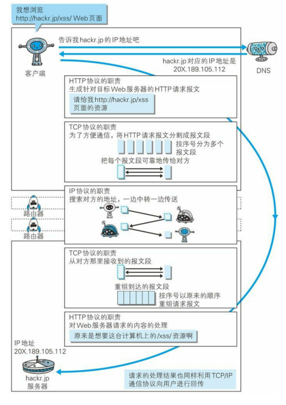

## 在浏览器出入URL到显示页面的过程
先看下面一张图：

``` bash
  1. 当用户在浏览器输入一个URL后，浏览器会利用DNS协议查找域名对应的ip，这时找到了要连接的服务器；
  2. 然后浏览器通过http协议生成一个http请求报文，并向web服务器发送这个http请求报文，期间通过tcp协议与服务器建立连接；
  3. 与服务器建立连接后，在网络层通过ip协议发送数据，ip数据包在路由之间使用OPSF协议进行路由选择，路由器在于服务器通信时，需要使用ARP协议将ip地址转成MAC地址；
  4. 服务器通过TCP协议接收到请求和通过http协议处理请求，同样通过http协议生成要返回的HTML页面和使用TCP协议返回页面内容。
  5. 浏览器接收到页面内容，渲染页面。
```
这张图也简单解释了各个协议与HTTP协议的关系。
<!-- more -->
## OSI七层体系和TCP/IP体系
+ OSI七层体系
	1. 应用层
	2. 表示层
	3. 会话层
	4. 运输层
	5. 网络层
	6. 数据链路层
	7. 物理层
+ TCP/IP体系
	1. 应用层（对应OSI中的上三层：应用层、表示层、会话层；各种应用层协议如http,smtp,ftp,telnet协议等）
	2. 运输层（TCP，UDP协议）
	3. 网络层（IP层）
	4. 网络接口层（对应OSI中的最下面两层：数据链路层、物理层）
+ 五层体系
	1. 应用层
	2. 运输层
	3. 网络层
	4. 数据链路层
	5. 物理层   

相对于OSI和TCP/IP体系，提出的一种折中的描述。其实就是将TCP/IP体系的网络接口层还原成数据链路层和物理层了，这样结合两种体系的描述相对更好理解。
## 状态码
``` bash
1XX：信息性状态码。如：接收的请求正在处理。
2XX：成功状态码。如：请求成功处理。
3XX：重定向状态码。如：需要附加操作以完成请求。
4XX：客户端错误码。如：服务器无法进行操作。
5XX：服务器错误码。如：服务器处理请求出错。
```
## HTTP中的长连接和短连接
在HTTP/1.0中默认使用短连接，即客户端和服务器每进行一次http操作，就建立一次连接，任务结束就断开连接。如果客户端请求的HTML中包含其他web资源（如js文件，css文件，图片等），每有一个其他的web资源都会新建一个http会话。
而从HTTP/1.1起，默认使用长连接。使用长连接的HTTP协议，会在响应头中加入这行代码`Connection:keep-alive`
keep-alive也不是永久保持连接的，这个保持时间是在服务器（如apache）中进行设置的，同时长连接需要客户端和服务器都支持。
**HTTP协议的长连接和短连接，实质上是TCP协议的长连接和短连接。**
[**具体关于长短连接的介绍可点击这里**](https://www.cnblogs.com/gotodsp/p/6366163.html)
